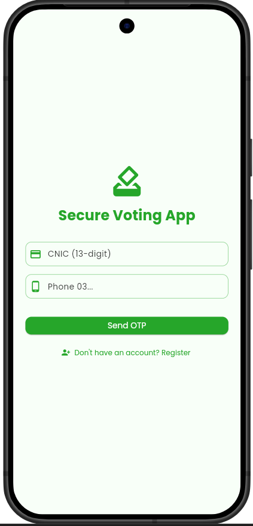
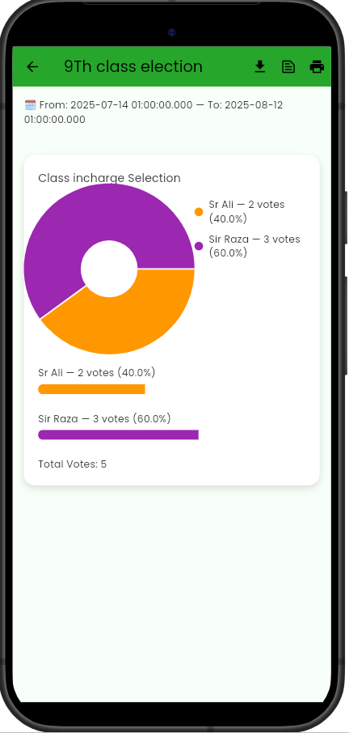

# 🗳️ Online Voting App – Student Council Elections  
**Final Year Project (Flutter & Firebase)**

A secure, transparent, and cross-platform **Online Voting Application** built using **Flutter & Dart**, designed primarily for **Student Council Elections**.  
The system uses **Firebase (Auth, Firestore, Storage)** for a secure backend, **Provider** for reactive state management, and a **private blockchain concept** to ensure **tamper-proof vote recording**.

---

## 🚀 Key Objectives

- Provide a **secure digital voting system**
- Ensure **one person = one vote**
- Enable **real-time results**
- Maintain **transparency & immutability** using blockchain principles
- Support **Admin & Voter roles**
- Work seamlessly on **Android, Web, and Desktop**

---

## 📌 Features

### 👤 Authentication & Roles
- Firebase Authentication (Email/Password)
- Role-based access (Admin / Voter)
- Secure session handling

### 🗳️ Voting System
- Multiple elections & positions
- One-time vote enforcement
- Vote history tracking
- Real-time vote count updates

### 🧑‍💼 Admin Panel
- Create & manage elections
- Approve candidates
- Manage users & applications
- View analytics & results

### 🔗 Blockchain Integration (Private)
- Votes stored as blockchain blocks
- Hash-linked vote records
- Tamper detection
- Transparent audit trail

### 📊 Results & UI
- Live election results
- Graph-based visualization
- Clean, responsive UI
- Error handling & empty states

---

## 🛠️ Built With

- **Flutter & Dart**
- **Provider** – State Management
- **Firebase Authentication**
- **Cloud Firestore**
- **Firebase Storage**
- **fl_chart** – Result graphs
- **Private Blockchain Logic (Custom)**

---

## 📸 App Screenshots

### 🔐 Authentication
| Splash | Login | Registration |
|------|------|-------------|
|  |  |  |

### 🧑‍🎓 Voter Module
| Dashboard | Voting | Result |
|---------|--------|--------|
|  |  |  |

### 🧑‍💼 Admin Module
| Dashboard | Create Election | Manage Elections |
|----------|-----------------|------------------|
|  |  |  |

### 🔗 Blockchain & Transparency
| Blockchain Validation | All Results |
|----------------------|-------------|
|  |  |

### ⚙️ Profile & Settings
| Profile | Settings |
|--------|----------|
|  |  |

---

## 📁 Project Structure (Clean Architecture)

The project follows **Clean Architecture + Feature-Based Structure** for scalability and maintainability.

```text
lib/
├── core/
│   ├── config/
│   ├── constants/
│   ├── utils/
│   └── widgets/
│
├── features/
│   ├── auth/
│   ├── election/
│   ├── blockchain/
│   └── admin/
│
├── shared/
│   ├── widgets/
│   └── providers/
│
├── firebase_options.dart
├── main.dart
└── app.dart
````

---

## 📂 Recommended Firestore Structure

```text
users/{uid}
  ├── name
  ├── rollNo
  ├── department
  └── role (admin / voter)

elections/{electionId}
  ├── title
  ├── status
  ├── startTime
  └── endTime

positions/{positionId}
  ├── name
  └── electionId

candidates/{candidateId}
  ├── name
  ├── positionId
  ├── department
  ├── image
  └── votes

votes/{uid}
  └── { positionId : candidateId }
```

---

## 🔐 Firebase Security Rules (Excerpt)

```js
rules_version = '2';
service cloud.firestore {
  match /databases/{database}/documents {

    function isAuthenticated() {
      return request.auth != null;
    }

    function isAdmin() {
      return isAuthenticated() &&
      get(/databases/$(database)/documents/users/$(request.auth.uid))
      .data.role == 'admin';
    }

    match /users/{userId} {
      allow read: if isAuthenticated();
      allow write: if isAdmin() || request.auth.uid == userId;
    }

    match /elections/{id} {
      allow read: if isAuthenticated();
      allow write: if isAdmin();
    }

    match /votes/{id} {
      allow create: if isAuthenticated();
      allow read: if isAdmin();
    }
  }
}
```

---

## ⚡ Setup & Installation

### 1️⃣ Clone Repository

```bash
git clone https://github.com/AliRaza-KhaliHussain/StudentCouncilElectionsApp.git
```

### 2️⃣ Firebase Setup (Local Only)

> ❌ Do NOT commit Firebase keys

```text
android/app/google-services.json
ios/Runner/GoogleService-Info.plist
```

Generate config:

```bash
flutterfire configure
```

### 3️⃣ Install Dependencies

```bash
flutter pub get
```

### 4️⃣ Run App

```bash
flutter run
```

---

## 📜 Important Notes

* ✅ Firebase keys are **NOT uploaded**
* ✅ Dummy `firebase_options.dart` only
* ✅ Each contributor must configure Firebase locally
* ✅ Blockchain logic is **private & local**

---

## 🎓 Academic Declaration

This project is developed as a **Final Year Project (FYP)** for the **BS Computer Science** degree.
It demonstrates concepts of:

* Secure system design
* Cloud backend integration
* State management
* Blockchain fundamentals
* Cross-platform mobile development

---

## 👤 Author

**Ali Raza**
BS Computer Science
Flutter & Firebase Developer

---

⭐ If you like this project, don’t forget to **star the repository**!

```

---

## ✅ NEXT UP (Highly Recommended)
I can now help you with:

- 📄 **FYP Report (Chapter-wise mapping)**
- 🧱 **System Architecture Diagram**
- 🎥 **Demo Video Script**
- 🔐 **Blockchain explanation for Viva**
- 📊 **Result graphs explanation**
- 🧪 **Testing & evaluation section**

Just tell me 👍
```
